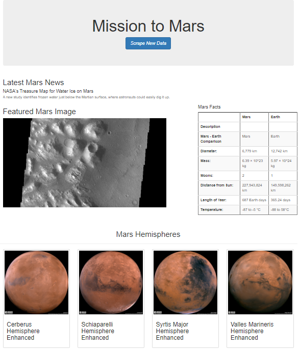

# Mission to Mars
## Purpose
The purpose of this project was to scrape the web for data related to the Mars Mission, and then display that data on a website.  We scraped Mars news, JPL featured image, a table of Mars facts, and photos of Mars' hemispheres.  After scraping this information, it was saved to a MongoDB database.  Mongo is a non-SQL database more suited to storing information that is not necessarily in tabular form.  

Finally, I stylized the website by italicizing the Scrape New Data button and resizing the bootstrap columns to show all four hemisphere images on one row.

## Resources
**Data Sources:** 
- Mars news site: https://data-class-mars.s3.amazonaws.com/Mars/index.html
- JPL Featured Image: https://data-class-jpl-space.s3.amazonaws.com/JPL_Space/index.html
- Mars Facts: https://data-class-mars-facts.s3.amazonaws.com/Mars_Facts/index.html
- Mars Hemisphere Images:https://marshemispheres.com/

 

**Software & Packages:**
- Python 3.8.8
- Jupyter notebook 6.4.0
- VS Code 
- Flask
- MongoDB
- Bootstrap
- Splinter

## Conclusion
I found this project (and this module) very difficult, and very time consuming.  Interestingly, when my mars hemispheres finally appeared on my 'site', it was more gratifying than when I completed some simpler assignments.  I'm in no hurry to do web-scraping for a living, but I do find the whole concept more appealing than when I began this unit.

## Stylized Site

